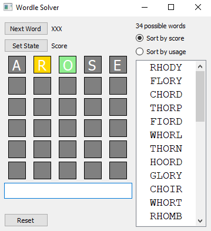

# Wordle-Solver

## Wordle Solver Development

## M. Palmer, February 2022

Synopsis
--------

I started developing some Wordle helper code just for fun and here's what I have so far.  Currently there's no real automation --- 
it requires a human in the loop.  You run this script and play Wordle simultaneously. As Wordle gives you feeback on your word guesses, you duplicate the 
results on the script's grid.  

The script's GUI presents six rows of 5-letter postions just like the game.  Either type words into the single-line edit box, or click on the word in the 
possible word list and it will transfer to the edit box.  Press Enter to load it onto the grid.

Clicking each grid letter cycles it through the result possibilties - grey (not in word), gold (in word by not here), green (correct letter/placement). 
As results are being entered and letters painted on the grid, the list of remaining words that fit the pattern gets updated. 

By default, the possible words list sorts by the likelihood of generating useful feedback if played on the next move.  This is "Sort by score".  
If you select the "Sort by usage" radio button, the list sorts according to common usage frequency.

python stats.py

python wordle3.py

stats.py contains the scoring functions and is imported into wordle3.  wordle3 consists of the GUI code and word-list processing logic.

Wordle word lists are from (https://github.com/Kinkelin/WordleCompetition)

